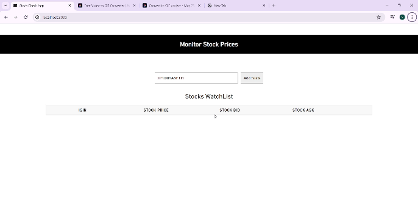

# Stock Monitoring Application

This is a Vue.js application developed for monitoring one's stock prices in real-time using WebSocket connections. Users can subscribe to stocks by entering their ISIN numbers, and the application displays the latest price information for each subscribed stock. I've provided two sample ISIN below.

## Demo 

## Technologies Used
Overall, this project showcases the utilization of cutting-edge tools and technologies in web development, including Vue 3 with the Composition API, Vite for rapid development, TypeScript for type safety, and WebSocket communication for real-time data updates. By combining these elements, the application delivers a modern and responsive user interface while providing users with timely and accurate stock market information for subscribed stock.

## Setup Instructions

1. Clone this repository to your local machine.
2. Navigate to the project directory.
3. Install dependencies using `npm install` or `yarn install`.
4. Start the development server with `npm run dev` or `yarn dev`.

## Sample ISIN

1. DE000BASF111
2. US0378331005

## Features

- **Real-time Updates:** Utilizes WebSocket connections to receive real-time updates for subscribed stocks.
- **Subscription Management:** Allows users to subscribe and unsubscribe to stocks using their ISIN numbers.
- **Responsive Design:** Supports desktop and mobile screen widths for optimal user experience.

